Multi variate LSTM anomaly detection
======================================
# Anomaly detection

Anomaly detection is a process of finding an unusual behavior in dataset. Time series anomaly detection has traditionally relied on a variety of statistical methods to try to predict anomalies in sequential data.

There are several ways to carry out anomaly detection, using statistical methods such as clustering, wavelet transforms, autoregressive models, and other machine learning and digital signal processing techniques. Within machine learning, the time series anomaly detection problem can be classified into two categories: supervised and unsupervised. 
[reference](https://dspace.mit.edu/bitstream/handle/1721.1/123129/1128282917-MIT.pdf?sequence=1&isAllowed=y)


In this project, we will implement the LSTM Auto encoder techniques in **Green Energy Dataset**.

1. [Explore data](#Data-explore)
2. [EDA](#EDA)
3. [Features selection & Drop](#Feature-selection)
    1. [Check corr](#Check-corr)
4. [Data preprocessing](#Data-preprocessing)
5. [Model define](#Model-define)
6. [Prediction & Visualize loss](#Visualize-Loss)
7. [Anomaly Detection](#Anomaly-Detection)
    1. [Threshold Setup](#Threshold-Setup)
    2. [Global Anomaly](#Global-Anomaly)
    3. [Local Anomaly](#Local-Anomaly)
8. [Visualize Result](#Visualize)
9. [To Do](#To-DO)
    1. [Import data from DB](#Import-data-from-DB)
    2. [Implementation of Model in Real time dataset](#Implementation-of-Model-in-real-time-dataset)
    3. [Build an API](#Build-an-API)


    ##########################################################################

## Explore data

It's always hard to find out public data as we desire. Especially in Green Energy field. Furthermore, green energy data highly depends on weather. So getting all the data in one file is not easy. Here we first extract all the required features and visualize them. 
Let's see [here](explore_data.ipynb).

## EDA
After exploring all the information about data, we can use EDA to see important features, missing values, correlations and etc. There are many other open sources and libraries to do EDA but we would like to use pandas profile reader package to see everything at once.

Here we go: 

Install profile report:
```
pip3 install pandas-profiling==2.7.1 #check version
```

Visualize the information of data:

```
pp.ProfileReport(df)
```

If no error the we can see: 

-> Overview

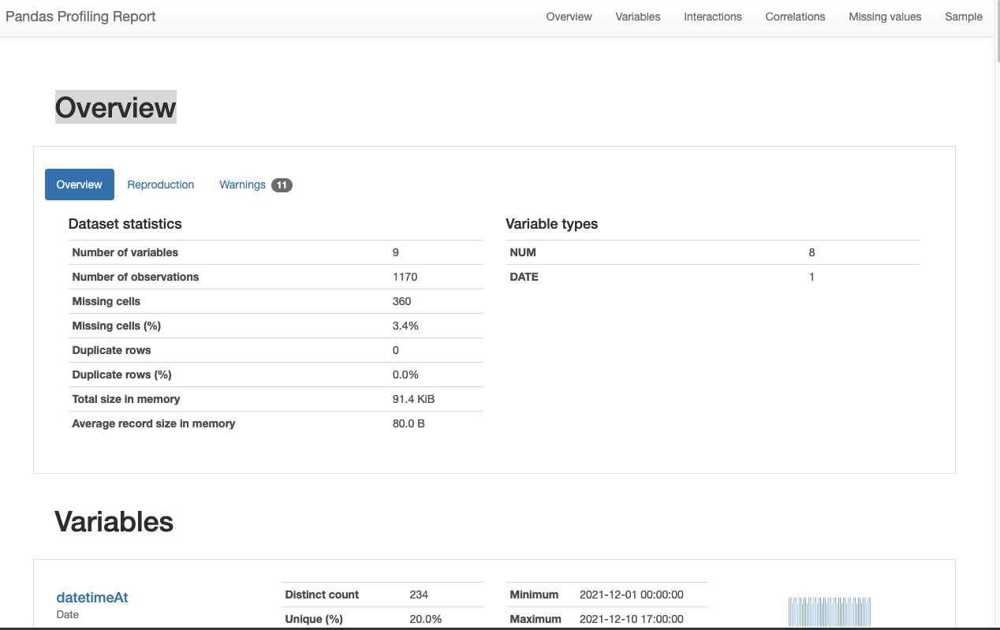

-> Warnings

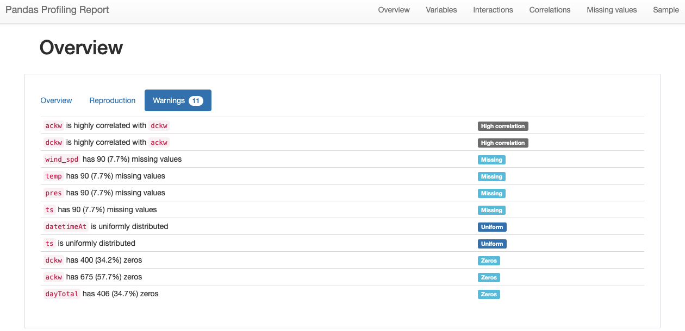


**This methods will also plot each features's relationship.**

We didn't include all plots here. 

We will directly go to the correlation part.

### Check corr


**Correlation - Pearson's**

The Pearson's correlation coefficient (r) is a measure of linear correlation between two variables. It's value lies between -1 and +1, -1 indicating total negative linear correlation, 0 indicating no linear correlation and 1 indicating total positive linear correlation. Furthermore, r is invariant under separate changes in location and scale of the two variables, implying that for a linear function the angle to the x-axis does not affect r.  To calculate r for two variables X and Y, one divides the covariance of X and Y by the product of their standard deviations.


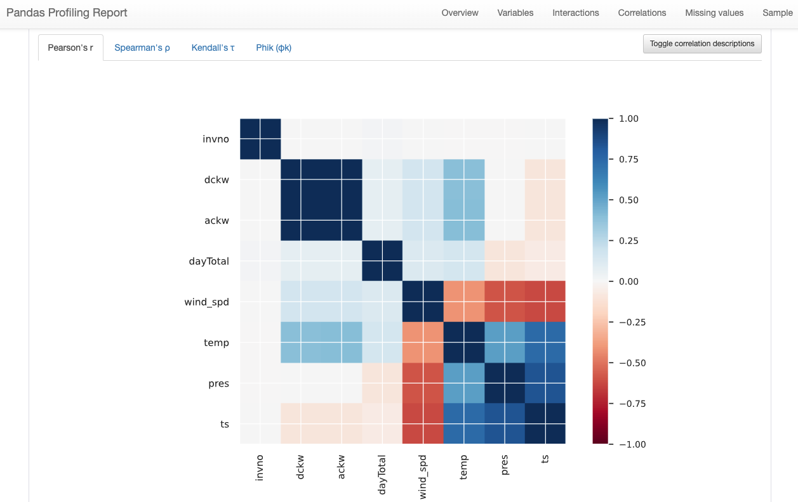


**Correlation - Spearman's**

The Spearman's rank correlation coefficient (ρ) is a measure of monotonic correlation between two variables, and is therefore better in catching nonlinear monotonic correlations than Pearson's r. It's value lies between -1 and +1, -1 indicating total negative monotonic correlation, 0 indicating no monotonic correlation and 1 indicating total positive monotonic correlation.

To calculate ρ for two variables X and Y, one divides the covariance of the rank variables of X and Y by the product of their standard deviations.

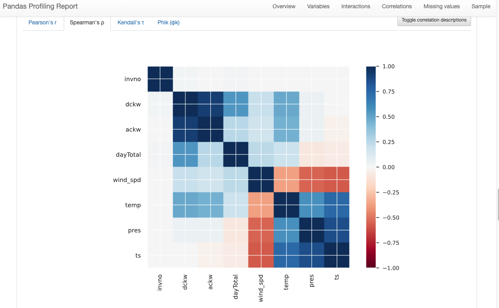

**Correlation - Phik'**

Phik (φk) is a new and practical correlation coefficient that works consistently between categorical, ordinal and interval variables, captures non-linear dependency and reverts to the Pearson correlation coefficient in case of a bivariate normal input distribution. There is extensive documentation available here.

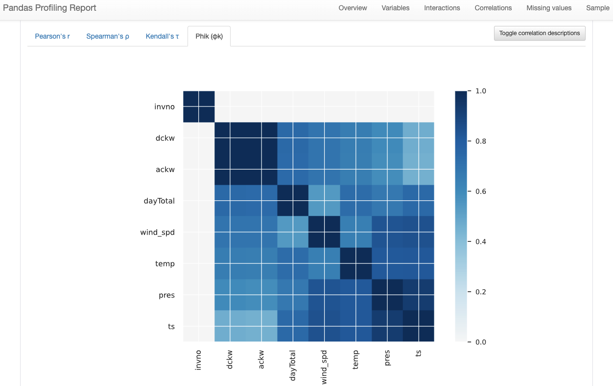

**Kurtosis & Skewness normality**

We can also find out Kurtosis, Skewness ( To Do)

## Features selection & Drop

The main purpose of EDA is to find out the information of missing values, important features and highly correlated features. 


So we are going to drop `invno`, `ackw(Because if we have dckw then only we get ackw from inverter)`, `ts` features.

From Spearman's correlation we can see that `dckw`, `datTotal`, `wind_speed`, `temp` are correlated to each other. I would like to include `pres` to in my features list(only for test).


## Data preprocessing

- Import data and make index column

Since we have already merged and make a new csv file in previous section, I will directly import combined csv and fill all missing values with 0. Also setup date and time as an index.

```
def Data():
    dataset = pd.read_csv('./combined.csv')
    dataset = dataset.fillna(0)
    #dates = dataset['datetimeAt']
    dataset = dataset.drop(columns = ['invno', 'ts'])
    dataset = dataset.set_index('datetimeAt')
    return dataset

#print(Data())

```

We can use simple python function to drop less important features. 


- Create dataset, split , make train, test and reshape data.

We also define parameters `TIME_STEPS` to use previous data and `DATA_TO_PREDICT` for future prediction. 

One can check preprocessing code inside of [`class AutoEncoder`](lstm_anomaly.py).

***Dataset Information***

- Features :  datetimeAt, dckw , ackw, dayTotal ,wind_spd , temp, pres
- Dataset shape:
    - train: (819, 6)
    - test: (351, 6)
- Time steps : 1, 7 or 30
- Data point to predict : 1, 2, 3 steps ahead

##############################################################################

## Model define

 LSTM (i.e., Long Short Term Memory model), an artificial recurrent neural network (RNN). This network is based on the basic structure of RNNs, which are designed to handle sequential data, where the output from the previous step is fed as input to the current step. LSTM is an improved version of the vanilla RNN, and has three different “memory” gates: forget gate, input gate and output gate. The forget gate controls what information in the cell state to forget, given new information that entered from the input gate. Our data is a time series one, and LSTM is a good fit for it. Although other methods may improve the result.
 [reference](https://blog.taboola.com/anomaly-detection-using-lstm-autoencoder/)

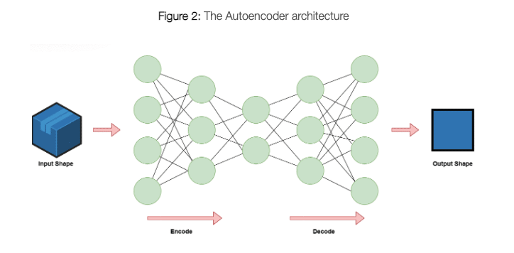

[reference](https://blog.taboola.com/anomaly-detection-using-lstm-autoencoder/)

Our goal is not only forecast a single metric, but to find a global anomaly in all metrics combined, the LSTM alone cannot provide us the global perspective that I need, therefore, we decided to add an Autoencoder.

Used `LSTM` model:

```
# Define LSTM model, include drop out, adam optimizer is used with mse loss function
def build_model(self):
    self.model = Sequential()
    self.model.add(LSTM(units=16, input_shape=(self.X_train.shape[1], self.X_train.shape[2])))
    #self.model.add(Dropout(rate=0.05))
    self.model.add(RepeatVector(n=self.X_train.shape[1]))
    self.model.add(LSTM(units=16, return_sequences=True))
    #self.model.add(Dropout(rate=0.2))
    self.model.add(TimeDistributed(Dense(self.X_train.shape[2])))
    # self.model.add(Activation('relu'))
    #self.model.compile(optimizer='adam', loss='mse')
    self.model.compile(optimizer=tf.keras.optimizers.Adam(learning_rate=0.005), loss="mse")
```


In this project, We have used all the chosen features as a metrics and tried to predict what would be the out come in near future(Data Point To PREDICT = 3).

We used `shuffle= False` to maintained the order of time steps.

```
 def fit_model(self, epochs, batch_size):
        self.history = self.model.fit(self.X_train, self.Y_train, epochs=epochs, batch_size=batch_size,
                                      validation_split=0.1,
                                      shuffle=False)
```                                   


***Error Function***

We decided to choose `mse` which gave me smooth result.


##  Prediction & Visualize loss

We always need to see that whether our training is going well or not. 

```
# plot train and test loss to check whether training went right or wrong
def plot_train_loss(self):
    plt.figure(3)
    plt.plot(self.history.history['loss'], label='train')
    plt.plot(self.history.history['val_loss'], label='val_loss')
    plt.legend()
    plt.show()
```

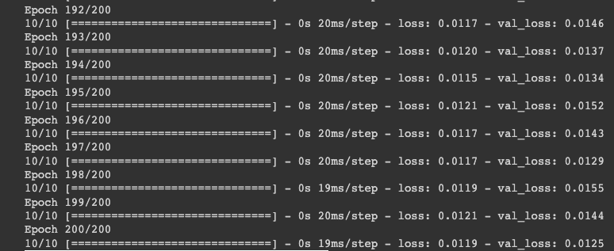 | 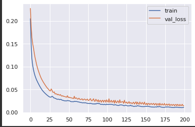
:-------------------------:|:-------------------------:

***Evaluate prediction error***

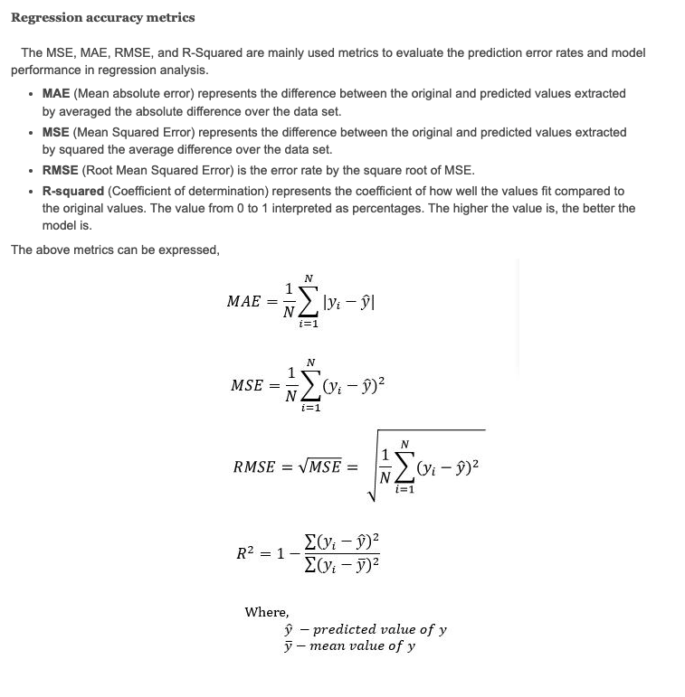

Calculate loss
```
Train mae loss:
Test mae loss: 
```


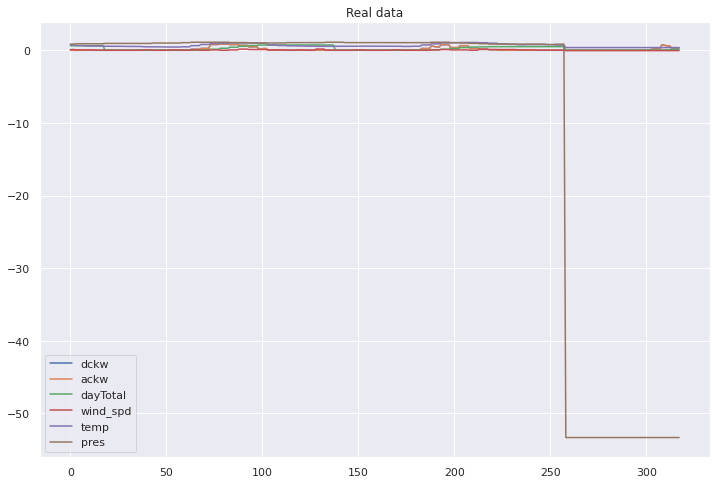 | 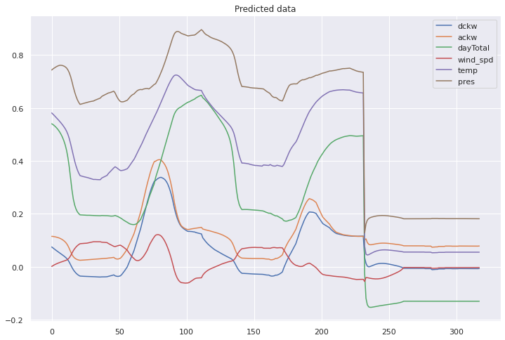
:-------------------------:|:-------------------------:

## Anomaly Detection

***How can we decide Anomaly?***

Anything greater than a fixed threshold could be consider as an Anomaly.

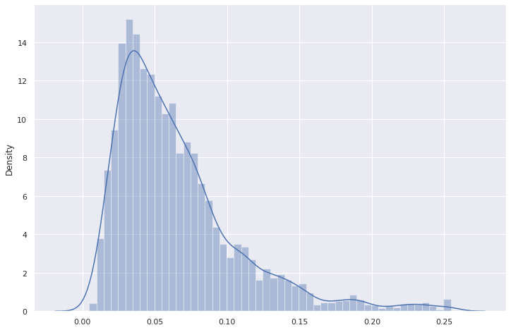


Result of Anomaly detection

### Threshold Setup


***Static Threshold***

Static Threshold >>>>> calculated overall mean + 2 std steps of the MAE on the entire trained data.

```
pred_error_threshold = np.mean(train_pred_errors) + 3 * np.std(train_pred_errors)
```
***Dynamic Threshold***

For the dynamic threshold, we will need two more parameters — window inside which we will calculate threshold and std_coef that we will use instead of 3 from the static threshold formula.

- For ARIMA window=40 and std_coef=5
- For CNN and LSTM window=40 and std_coef=6


These two parameters are empirically chosen for each model using only the training data.

We can also visualize average loss, rolling mean, threshold, exponential mean.


```
#code to calculate the dynamic threshold:


# We use Series from pandas to calculate windowed errors
train_pred_errors_windowed = pd.Series(train_pred_errors).rolling(window=window, min_periods=1)
# Dynamic threshold for the training data
train_dynamic_threshold = train_pred_errors_windowed.mean() + std_coef * train_pred_errors_windowed.std()

valid_pred_errors_windowed = pd.Series(valid_pred_errors).rolling(window=window, min_periods=1)
# Dynamic threshold for the validation data
valid_dynamic_threshold = valid_pred_errors_windowed.mean() + std_coef * valid_pred_errors_windowed.std()

```

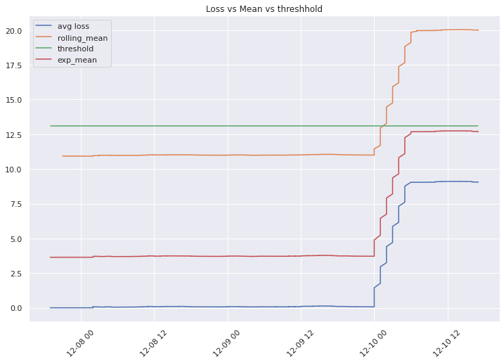 | 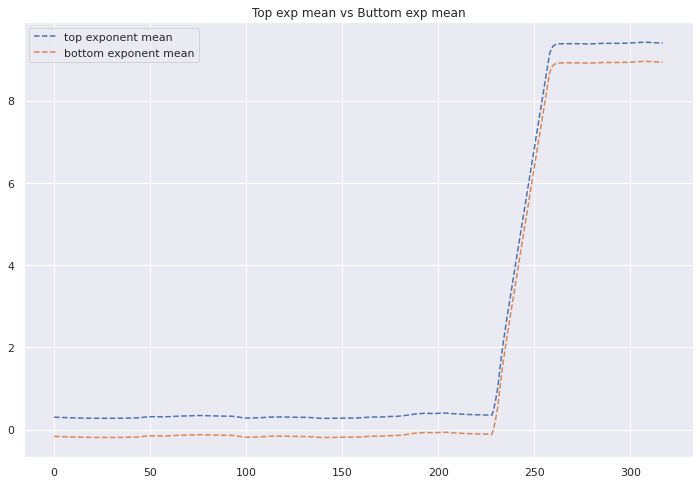
:-------------------------:|:-------------------------:

Above figure presents the mean loss of the metrics values with static threshold in green, rolling mean threshold in orange, and exponential mean threshold in red

**What is rolling mean?**
A moving average(rolling mean) is commonly used with time series data to smooth out short-term fluctuations and highlight longer-term trends or cycles. The threshold between short-term and long-term depends on the application, and the parameters of the moving average will be set accordingly.

The simple moving average is the unweighted mean of the previous M data points. The selection of M (sliding window) depends on the amount of smoothing desired since increasing the value of M improves the smoothing at the expense of accuracy.
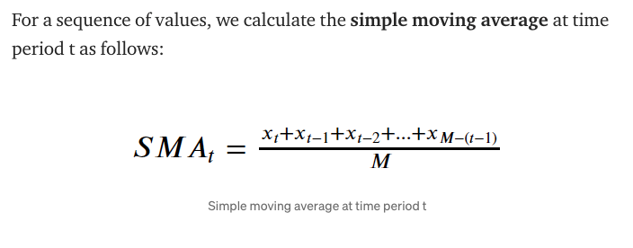 | 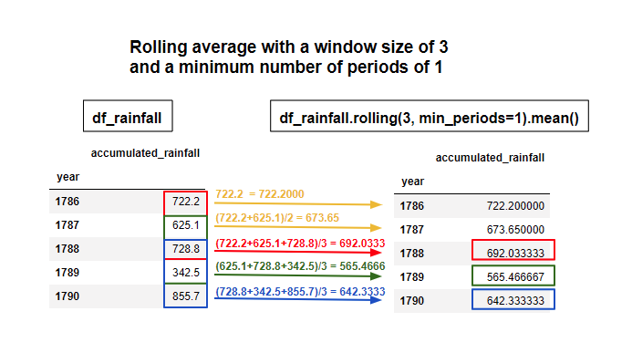
:-------------------------:|:-------------------------:


[reference](https://towardsdatascience.com/moving-averages-in-python-16170e20f6c)


### Global  & Local Anomaly

Global anomaly (yellow points) is triggered when the mean loss of all metrics cross a threshold (which is lower than the local anomaly threshold)

```
############################################ Check mean, threshold and global anomalies ################################################
                        loss      rolling_mean    exp_mean  threshold     global_anomaly
datetimeAt                                                         
2021-12-07 19:00:00  0.255701     11.056723         3.800142  12.986072         False         
2021-12-07 20:00:00  0.254932     11.091915         3.799565  12.986072         False   
2021-12-07 20:00:00  0.254157     11.066023         3.798895  12.986072         False   
2021-12-07 20:00:00  0.253280     11.074941         3.798102  12.986072         False   
2021-12-07 20:00:00  0.252391     11.083548         3.797252  12.986072         False  
```

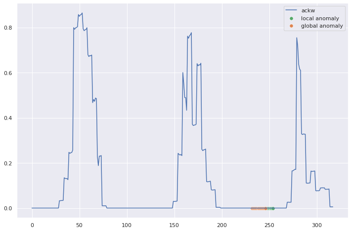


```
is_global_anomaly_exp_mean = abs(mean_exp - loss_mean_vec) > threshold_mean_exp + num_of_std * std

        is_global_anomaly_exp_mean = np.array(is_global_anomaly_exp_mean)
        index = 0
        for metric in self.data.columns:
            threshold = self.train_loss_mean[index] + num_of_std * self.train_loss_std[index]
            is_anomaly = self.test_loss[:, index] > threshold
            global_anomaly_x = []
            global_anomaly_y = []
            x = []
            y = []
            for i in range(0, len(is_anomaly)):
                if is_global_anomaly_exp_mean[i]:
                    global_anomaly_x.append(i)
                    global_anomaly_y.append(self.Y_test[i, TIME_STEPS-1, index])
                    pass
                elif is_anomaly[i]:
                    x.append(i)
                    y.append(self.Y_test[i, 0, index])
```


## Visualize Result

- Anomaly detection result with simple LSTM and general loss value:

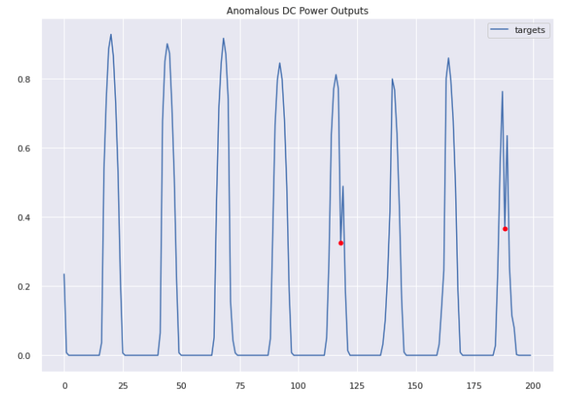 | 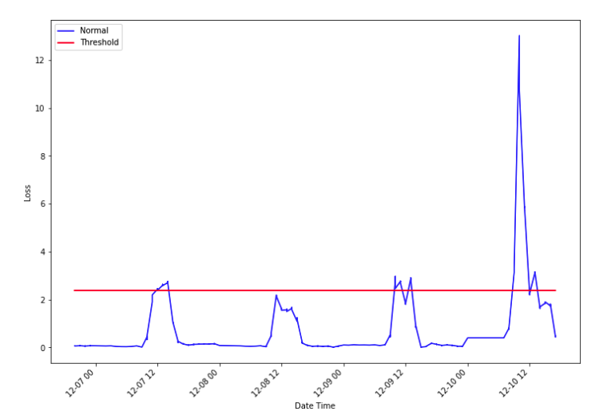
:-------------------------:|:-------------------------:

- Detection information
```
Indices of anomaly samples:  (array([147, 192]),)
##################### Details of anomaly ###################
[{'Datetime': Timestamp('2021-12-02 16:00:00'),
  'dckw': 4.213291015625,
  'invno': 1},
 {'Datetime': Timestamp('2021-12-02 06:00:00'),
 'dckw': 0.0, 
	'invno': 4}}]
```


- Anomaly detection with dynamic and static threshold 


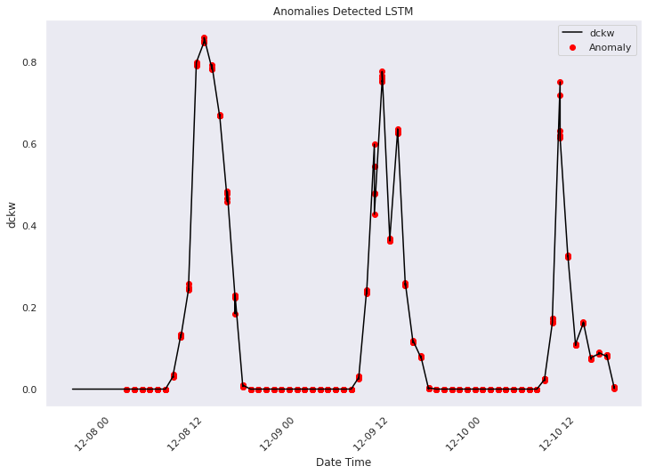

oh ---to many anomalies, I will have to check my threshold, 


Need to check threshold.

## To Do
### Import data from DB
### Implementation of Model in Real time dataset
## Build an API

